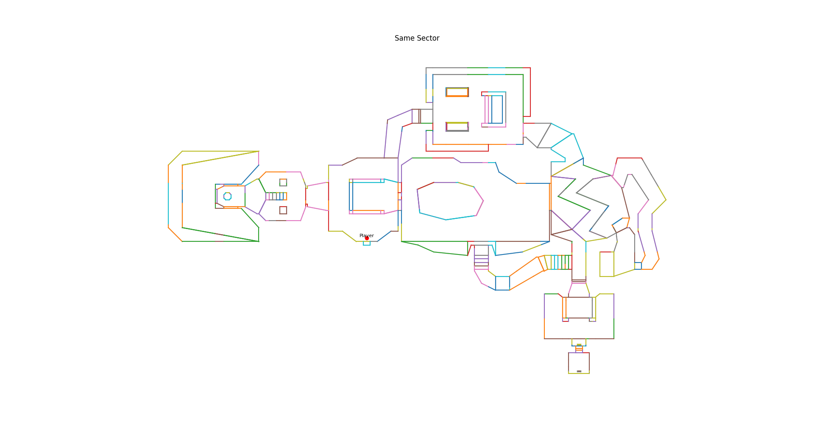

# BSP Split Visualizer

A Python tool for visualizing how Binary Space Partitioning (BSP) splits a 2D map into convex subregions — inspired by how games like DOOM and Counter-Strike (GoldSrc) organize geometry for efficient rendering and collision.

---

## Features

- Visualize how BSP recursively splits 2D line segments
- Animate the partitioning steps
- Render the resulting BSP tree or sector view
- Custom partitioning scoring and depth limits

---

## Usage

Run the visualizer using:

```bash
make run
```

Then choose a map file:

```bash
1. files/test.txt
2. files/de_dust2.txt
3. files/e1m1.txt
```

## Requirements

- Python 3.12+
- matplotlib

## Example Maps

- files/test.txt – Simple rectangle for debugging
- files/de_dust2.txt – Geometry extracted from CS 1.6
  
- files/e1m1.txt – Classic DOOM map converted to segments
  

## Author

Jason Kuan
Inspired by BSP techniques used in classic 2.5D game engines.

Let me know if you'd like:

- A `requirements.txt` file
- Instructions on how to extract maps (e.g., from BSP files)
- A section for contribution guidelines

Happy to add it!
